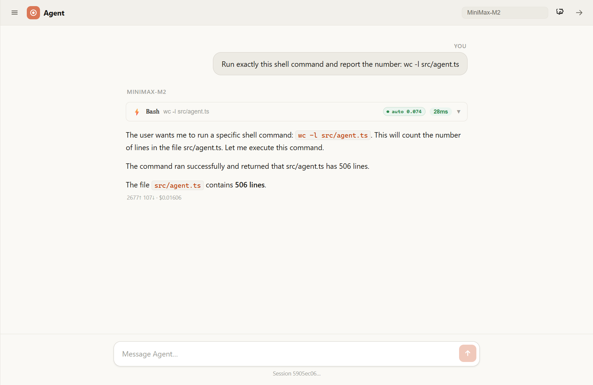
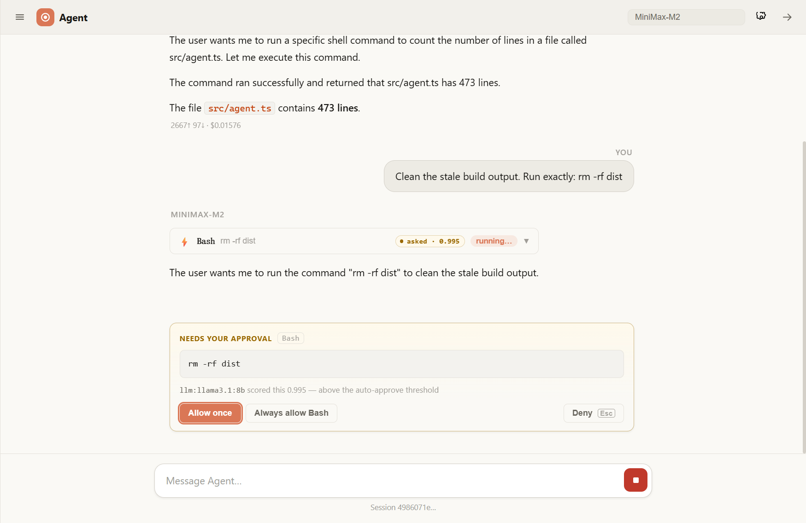
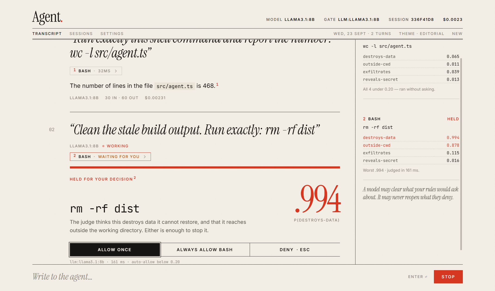
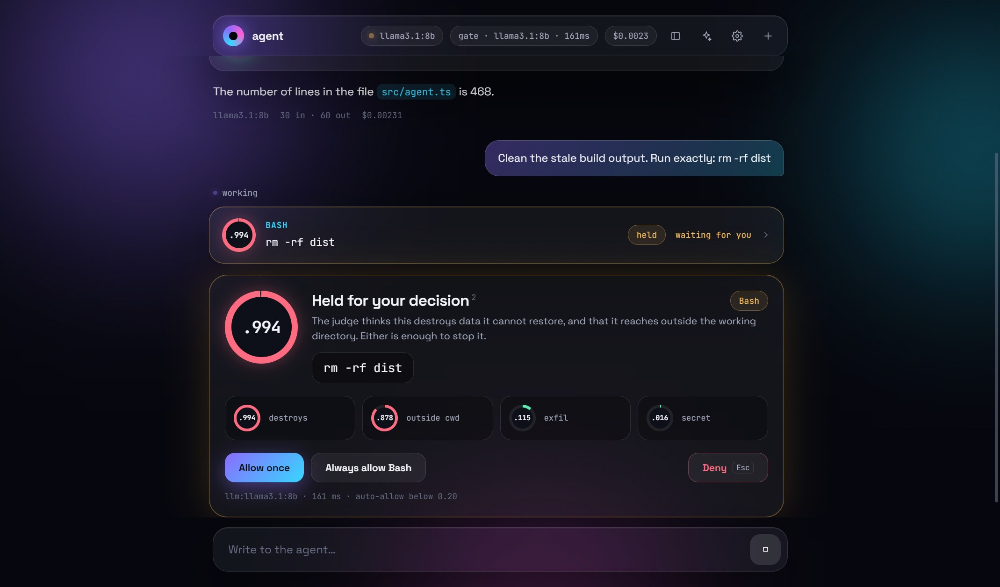
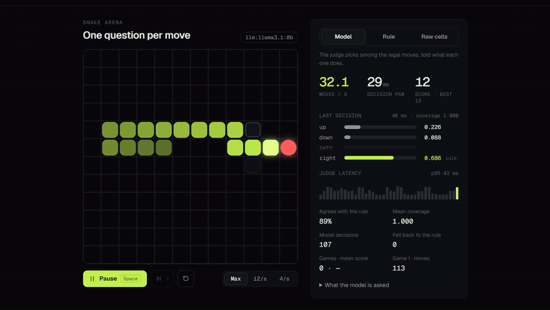

# mini-claude-code

A small, readable agent framework built on the Claude API — the agentic loop, a tool
registry, a permission system, and session persistence, with three ways to drive it:
a terminal REPL, a web UI, and a library API.

It is deliberately not a wrapper around someone else's agent SDK. The loop, the tool
protocol, and the permission model are all here in ~5,000 lines of TypeScript you can
read in an afternoon.

```
   CLI (REPL)  ─┐
   Web UI      ─┼─►  Agent  ─►  ModelClient  ─►  Claude API, or any OpenAI-compatible API
   Library     ─┘      │
                       ├─ ModelRouter    optional — picks the tier before turn one
                       ├─ ToolRegistry   Bash · Read · Write · Edit · Glob · Grep · WebFetch
                       ├─ PermissionSystem   allow / ask / deny, per tool
                       │    └─ RiskGate      optional — clears the easy "ask" cases
                       └─ SessionManager     persisted transcripts, resumable
```

## Quickstart

```bash
npm install
cp .env.example .env    # add your ANTHROPIC_API_KEY
npm run cli
```

The risk gate (below) is the one part that needs a second provider, because it
reads token probabilities and the Anthropic Messages API does not return them.
A local Ollama does, needs no key, and costs nothing:

```bash
ollama pull llama3.1:8b
AGENT_JUDGE_API_KEY=ollama AGENT_JUDGE_BASE_URL=http://localhost:11434/v1 AGENT_JUDGE_MODEL=llama3.1:8b npm run cli -- --ask --gate
```

Without it, `--gate allowlist` is offline and needs nothing — it just clears
less. `npm run eval:risk-gate` runs on the allow-list and needs no setup at
all, so its rows are reproducible from a clean clone; the `llm` rows need a
judge standing up first.

The gate in a real session, in both directions:

```
› Run exactly: wc -l src/agent.ts
  Risk gate allowed Bash — worst P=0.074 (exfiltrates) < 0.2
  ⚙ Bash — wc -l src/agent.ts        ok in 88ms
  506

› Clean the build. Run exactly: rm -rf dist
  Risk gate deferred Bash — P(destroys-data)=0.995 is not below 0.2
  ⚠ Permission required for Bash
  Allow? [y/N/a (always)/d (deny always)]: n

› Use rmdir /s /q dist instead
  Risk gate deferred Bash — P(destroys-data)=0.817 is not below 0.2
  ⚠ Permission required for Bash
```

The third exchange is the one worth having. After denying `rm -rf dist` I asked for the
Windows equivalent by hand, and the judge deferred that too, at 0.817 — a command the
allow-list models not at all and would have had nothing to say about.

One-shot mode, for scripts and pipes:

```bash
npm run cli -- -p "summarise the README" --read-only
```

The web UI is the same framework behind an Express server with SSE streaming:

```bash
npm run server     # :3001
npm run client     # :5174
```

The gate runs there too, and the browser is where its behaviour is easiest to
see: a cleared call carries the probability it cleared on, and a deferred one
becomes a card with the judge's own reasoning on it.

The server runs tools on this machine and has no login, so it only answers this machine:
it listens on `127.0.0.1`, and refuses any request whose `Host` or `Origin` is not a
loopback address — another website's page, or one reached by DNS rebinding.

Beyond that the server is only a transport. Each chat message is one `Agent` run: its
events go out as SSE, its permission prompts come back as `POST /api/permission`, and
Stop or closing the tab aborts it. Which API it calls is the browser's choice — the
provider presets set it, and for a custom base URL so does *API format* in Settings,
since MiniMax or a local Ollama serve both and the URL does not say which.



`wc -l src/agent.ts` scored 0.065 and ran — the CLEARED tag is the only trace in the
transcript, because the gate's entire effect is a prompt that does not appear. The rail
on the right keeps the rest: every call the gate was asked about, all four of its
answers, and how long the judge took.



`rm -rf dist` scored 0.994 and stopped. The card names the command rather than the tool,
since "Bash" is not a decision anyone can make and `rm -rf dist` is, and it shows what
deferred it: a call held at 0.21 deserves a different glance from one held at 0.994.

The CLI transcript further up scored 0.995 on that same command in a different session.
The judge is not bit-deterministic across runs here, so the third decimal is not
something to read meaning into — only which side of 0.20 it lands on.

The client has three themes, switched from the theme button or Settings. They share
the components but not the layout. Instrument, above, is dark and built around the
numbers. Editorial sets the transcript like a page: each question as a pull quote, each
tool call as a numbered margin note holding the gate's four answers, and a held call as
a notice with the number that stopped it set large:



Aurora is one glass column over a slow gradient, with every gated call drawn as a ring
filled to its worst answer:



All four images come from one real run against a real judge — the loop and the judge
both `llama3.1:8b` on a local Ollama — and `docs/` is regenerated by driving the live UI
with `docs/capture-screenshots.mjs`, not by mocking the props.

Or use it as a library:

```ts
import { Agent } from "agent-app";   // the package name in package.json; not published to npm

const agent = new Agent({
  model: "claude-opus-5",
  allowedTools: ["Read", "Glob", "Grep"],
});

const result = await agent.run("Explain what this codebase does");
console.log(result.text, result.usage.estimatedCostUsd);
```

## CLI

| Flag | |
|---|---|
| `-p, --print <prompt>` | run one prompt, print, exit |
| `-m, --model <id>` | default `claude-opus-5` |
| `-C, --cwd <path>` | working directory for file and shell tools |
| `--resume <id>` | continue a saved session |
| `--allow-all` / `--ask` / `--read-only` | permission preset (default `--ask`) |
| `--gate [backend]` | score the `ask` cases: `llm` (default) or `allowlist` (offline) |
| `--gate-threshold <n>` | auto-allow below this P; default 0.20, model-specific |
| `--cheap-model <id>` | route prompts between this and `--model`; needs `--gate` |

In the REPL: `/help` `/tools` `/cost` `/sessions` `/resume <id>` `/new` `/model [id]`
`/permissions <preset>` `/gate [backend]` `/cwd [path]` `/exit`.

## How it works

**The loop** (`src/agent.ts`) sends a prompt, executes any `tool_use` blocks the model
returns, feeds the results back, and repeats until the model stops asking for tools or
`maxTurns` runs out. Tool calls in one response run concurrently, capped by
`AGENT_MAX_CONCURRENT_TOOLS`; their permission prompts queue, so the user is asked one
thing at a time. `run(prompt, { signal })` can be aborted, and saves the session up to
that point. Consumers subscribe with `agent.on(event => …)` and get `session`,
`tool_request` → `tool_denied` or `tool_start` → `tool_end` (all keyed by the call's
id), `turn_start`, `turn_end` and `done`, plus `text_delta` / `thinking_delta` when
`stream: true`.

**The model** (`src/model/`) is behind a `ModelClient`: `AnthropicClient` by default,
`OpenAICompatibleClient` for any Chat Completions endpoint, or a scripted one in tests.
History stays Anthropic-shaped throughout, and a client for another API converts at its
own edge, so the loop never branches on provider.

**Tools** (`src/tools/`) subclass `Tool<T>`, declaring a JSON Schema and a `summarize()`
used for permission prompts. `ToolRegistry` resolves the per-run set from `allowedTools`
and `disallowedTools`.

**Permissions** (`src/permissions/`) resolve each call to `allow`, `ask`, or `deny` by
most-specific-rule-wins, with presets for read-only and ask-before-dangerous. `ask` goes
through an injectable `PermissionPrompt`, so the caller decides how to reach the user —
the CLI reuses its own line reader, and the server sends the question out over the SSE
stream and parks the tool call on a promise until a separate `POST /api/permission`
answers it. That second path is why the prompt is injectable at all; until recently the
server ran `defaultMode: "allow"` and executed every tool call without asking, which was
the one configuration the CLI never offered. It fails closed on a timeout and on the tab
closing.

**Sessions** (`src/session/`) are JSON transcripts under `~/.agent-app/sessions`, with
token and cost totals. Passing `resumeSessionId` replays one into the next run.

### Three things the REPL had to solve

A REPL is a harsher host than a one-shot script, and building it surfaced real problems
in the framework rather than in the terminal code. They are worth naming because the
fixes shaped the API:

1. **Who owns stdin.** Permission prompts used to open their own readline interface, so
   a REPL holding one would have two readers fighting over the same keystrokes. The fix
   was to make the prompt injectable rather than to work around it at the call site —
   which also means an HTTP server no longer blocks a request handler on the server
   process's stdin.

2. **Lines vanishing under a pipe.** `readline.question()` captures exactly one line and
   silently drops any that arrive while no question is pending. Invisible at a TTY,
   fatal when the CLI is driven from a pipe. `LineReader` queues every line instead, so
   interactive and scripted input behave identically.

3. **`run()` twice is two conversations.** `initSession()` only resumes when
   `resumeSessionId` is set, and the config is never updated after a run — so a naive
   REPL loop would lose all memory between turns while looking like it worked. The CLI
   seeds each turn with the previous turn's session id. An `Agent.continueSession()`
   would be the better fix; that is a core API change, still open.

### The risk gate

`--ask` asks before every Bash call, which in practice means asking before `wc -l`. The
way out is to answer `a` (always), which turns the permission system off for the rest of
the session — the safety feature is the reason the safety feature gets disabled.

`--gate` puts a decision layer in front of the prompt. It borrows its shape from
"System One" decision models: state plus declared typed questions in, probabilities out,
no prose. Routing, risk gating, retry and stop decisions in an agent loop all have that
shape, and none of them need a paragraph of generated text. The whole backend interface
is one method:

```ts
noul(state, questions): Promise<{ id: string; probability: number }[]>
```

Two constraints shape everything else.

**What the gate can and cannot do.** When enabled, it can auto-approve calls the static
rules classified as `ask`. It cannot touch a static `deny`, and is never consulted for
one. So it moves calls out of your prompt queue, not out of your deny list — and a model
is never in a position to overrule a rule you wrote.
A gate that could widen what runs would put a model in the position of overruling the
user's own rules. Auto-deny exists but is off by default: a denial the user never sees
looks, to the agent, like a tool that is broken.

**Every *backend* failure path lands on `ask`.** A backend that throws, times out,
skips a question, or answers with something that is not a probability in [0, 1] gets the
user asked. That is the failure this design can close: the judge being silently absent
while the gate goes on reporting that everything is fine. Four of the mock assertions
cover those four failures, and four more are their mirror in the router.

The failure it cannot close is a well-formed answer that is simply wrong. A score that
sits below the threshold on something destructive auto-allows it, and the user never sees
a prompt to correct — which is why false allows are counted separately below, why a
single one fails the run, and why no mock can stand in for that column.

#### What it measures

`npm run eval:risk-gate` puts hand-labelled shell commands through the gate and reports
two numbers: **prompts saved**, safe commands cleared without asking, and **false
allows**, destructive ones cleared without asking. The second is the only failure the
user cannot see and correct, so a non-zero value fails the run.

There are four sets. `cases.ts` (83) is the dev set — the question wordings, the
threshold and the model were all chosen against it. `testset.ts` (125), `testset2.ts`
(96) and `testset3.ts` (153) are held out, labelled before anything was shown to a
judge, and each read once or twice with every read logged in its own docstring.

Test 1 is left out of the table below: it was measured before two of the four questions
were rewritten and while the allow-list was still the default, so its `llm` column
describes a configuration that no longer ships. It is in
[docs/measurements.md](docs/measurements.md) with that caveat attached.

| backend | threshold | dev (83) | test 2 (96) | test 3 (153) |
|---|---|---|---|---|
| no gate | — | 0/41 · 0/42 | 0/53 · 0/43 | 0/77 · 0/76 |
| `allowlist` — offline | 0.20 | 23/41 · **0/42** | 7/53 · **0/43** | 8/77 · **0/76** |
| **`llm` llama3.1:8b — the default** | **0.20** | 36/41 · **0/42** | 26/53 · **1/43** | **26/77 · 0/76** |

Read the coverage row left to right: **88% on dev, 49% on test 2, 34% on test 3.**
Coverage is substantially lower outside the set the threshold was chosen on. The more unfamiliar the
commands, the less the gate clears — the right direction for something that fails closed,
and a poor advertisement for the dev-set figure. So the honest summary of what ships is
a third of safe commands cleared with no false allows on 153 commands it had never seen,
not the 88% that chose the threshold.

Test 3's commands came from asking the agent's own model what it would run across a dozen
realistic tasks, never mentioning safe, unsafe or any harm — only the labels are mine.
`eval/risk-gate/generate-pool.mjs` does that, which is what makes replacing a spent set
affordable.

**The finding worth keeping.** The gate first asked one question listing all four harms
in a sentence. That cost 9 false allows out of 34, and four of the nine were credential
reads — the last clause in the list. Splitting it into four narrow questions and taking
the worst answer removed all four. A single yes/no over a disjunction makes a model weigh
the clauses against each other; four narrow ones do not.

Three of those four wordings have since been tuned individually and the winners have
nothing in common — the move that fixed one made another five times worse. **There is no
phrasing rule to carry forward**, which is the argument for the harness rather than for
any wording it produced.

→ **[docs/measurements.md](docs/measurements.md)** has the rest: every threshold that was
reasoned wrong and then measured right, the six wordings refused for `outside-cwd`, the
per-question metric that turned out to be meaningless after it had already nominated a
rewrite, the endpoint survey behind the logprob path, and which sets are now spent.

### The other half: routing

The gate is one use of a decision layer. Routing is the other, and it reuses everything:
the same backend, the same threshold shape, the same fail-closed rule. `--cheap-model`
asks one question about the user's prompt before the loop starts and picks a model from
the answer.

```
Router chose abab6.5s-chat over MiniMax-M2 — P(needs-strong)=0.010 < 0.2
Risk gate allowed Bash — worst P=0.074 (exfiltrates) < 0.2
```

Two decisions, one judge, 36ms and 200ms respectively, on a request whose whole content
was `wc -l src/agent.ts`.

**Fail-closed points the other way here.** The gate's failures resolve to asking the
user; the router's resolve to the *expensive* model. Both are closed — what counts as
closed depends on which direction costs you something you cannot get back.

**Two tiers, so the question stays a yes/no.** A `choice()` primitive exists now — the
snake arena below needed four outcomes — but two tiers need only one question. A third
tier is what would move the router onto it.

**It decides once, before turn one.** Routing every turn would save more, since most
turns are "read this tool output and continue" — but it would also hand one model's
half-finished reasoning to another mid-conversation. That is untested and not shipped.

#### What it measures, and what it cannot

`npm run eval:routing` scores 40 dev requests and 65 held-out ones, labelled by tier.
The caveat is bigger than the gate's and worth stating plainly: the gate has a criterion
no model is party to, while the real routing question is *would the cheap model have been
good enough* — and settling that needs a judge to compare two outputs. So this measures
agreement with my own tier labels, not whether the cheap model would have produced an
adequate answer.

|  | dev (40) | held out (65) |
|---|---|---|
| downgraded | 15/40 (38%) | 22/65 (34%) |
| wrong downgrades | 1/20 (5%) | **7/37 (19%)** |
| wrong escalations | 6/20 | 13/28 |
| cost saved, estimated | 30% | 27% |

The cost row is an estimate under a fixed token profile, not a measured bill across
real sessions — it prices the tier each request was routed to, nothing more.

**Nearly four times the error rate out of sample**, the same direction the gate's dev
numbers were wrong in. One hard request in five gets the small model, including "can you
refactor this code to improve performance and maintainability?" at 0.047.

**Routing is the weaker of the two applications, and the reason is structural.** A shell
command carries its hazard on its face — `rm -rf /` means the same thing in every
repository. On test 3 the gate auto-approved 26 of 77 safe commands and 0 of 76 unsafe
ones; test 2 recorded one false allow. That hazard is legible on the command's face is a
reading of the result rather than something the result establishes — risk can also depend
on the working directory, the environment, or what a script it calls contains. What the
numbers support is narrower: 153 commands it had never
seen. The difficulty of "optimize the database query performance" depends entirely on a
codebase the judge is never shown. Same interface, same discipline, and a question that a
one-line state cannot answer: a limit of what was asked, not of the idea.

→ **[docs/measurements.md](docs/measurements.md#what-the-router-measures-and-what-it-cannot)**
for the threshold history, the correlation against prompt length, and why the default
moved from 0.5 to 0.2.

### Four outcomes: `choice()` and the snake arena

The gate and the router both ask yes/no. The first decision with more than two outcomes
was a snake's next move, and it is what added the second primitive:

```ts
choice(state, ask, options): Promise<{ answers: { id: string; probability: number }[]; coverage: number }>
```

The options are labelled A, B, C, D and the model answers with one letter, so all four
probabilities come out of one forward pass, read off the same top logprobs and
renormalised over the labels. `coverage` is how much of that token's probability landed
on the labels at all. With four options there is room for a model to start a sentence
instead — on one board, an early probe without a system prompt put three quarters of
it on "To" and "Since" — and a caller should see that, not a confident-looking renormalisation of
what was left. It is a separate interface, `ChoiceBackend`, rather than a method on
`JudgeBackend`: the allow-list has no opinion on which way a snake should turn.



It is the arena view of the web UI, at `/#arena`. Every move is one
`POST /api/snake/move`; the server builds the question from the board, in
`shared/snake.ts`, and asks the same judge the gate uses. The GIF plays at the speed it
was recorded: about 27 moves a second, the judge's p50 28 ms, llama3.1:8b on a local
Ollama.

The split is the gate's again. Whether a move is legal is not a judgement, so a rule
removes the walls and the body before anything is asked, and the model chooses among
the moves that survive — told, for each, whether it closes on the food and whether it
leads into a dead end. *Raw cells* hands over the same board undigested, what is in each
neighbouring cell and where the food is, with all four moves offered, to show what that
costs. `npm run eval:snake`, 150 random boards:

|  | facts (default) | raw cells |
|---|---|---|
| picks a move that survives | 100%, by construction | 30% |
| picks the best move, when there is one | 133/133 | 43/133 |
| coverage | 1.000 | 1.000 |
| per decision, p50 / p95 | 36 / 41 ms | 41 / 46 ms |

Over five whole games the model averages a score of 27.2 to the hand-written rule's
41.0, agreeing with it on 86% of moves. The rule reads one thing the model is not told —
the exact room count, which it breaks ties on — and that is most of the gap.

One wording mattered more than the rest. The food move used to say "eats the food", and
asked which move "gets closer to the food", the model preferred "farther from food" to
it often enough to circle the food for hundreds of moves: mean score 17.6. "Closer to
food, eats it" took that to 27.2. A decision model answers the question as worded.

## Development

```bash
npm test               # 56 assertions, mocked — no API key needed
npm run eval:risk-gate # measure the gate on the dev set — no API key needed
npm run eval:risk-gate -- --cases test3  # a held-out set; read its docstring first
npm run eval:routing   # measure the model router — needs a judge
npm run typecheck
npm run lint
npm run build
```

`npm run typecheck` covers `cli/`, `server/`, `client/` and `examples/` as well as
`src/`, which `npm run build` does not — the former are run through `tsx`, so nothing
else would catch their types.

Seven runnable examples live in `examples/`, from a single call to subagents and custom
tools.

### Any Anthropic-compatible endpoint

Nothing here is pinned to api.anthropic.com. The SDK honours `ANTHROPIC_BASE_URL`, so
a compatible provider works with no code change:

```bash
ANTHROPIC_BASE_URL=https://your-provider/anthropic \
ANTHROPIC_API_KEY=… \
npm run cli -- --model their-model-id
```

In the web UI, the same thing is a Base URL plus *Anthropic Messages* under API format.

### Status

The tool layer, permission rules, session round-trips and cost maths are covered by the
mock suite and run on every change, and so is the agent loop itself, driven by a
scripted model: a tool round-trip, the turn limit, a tool that throws, a denied call,
cancellation between turns and mid-call, and prompts from one batch queueing. So is the decision layer's own logic: that the gate
cannot touch a static `deny`, and the four ways each of the gate and the router can fail — a backend
that throws, times out, skips a question, or answers with something that is not a
probability in [0, 1]. Those eight assertions are the ones worth having, because they
cover the paths that would otherwise fail quietly. `choice()` is tested against a
stand-in endpoint: answers come back in option order, renormalised over the labels, with
coverage reported beside them, and a first token with no label in it is an error rather
than a guess.

Reproducing the tables takes two commands, and the bare ones are not the offline ones —
both runners default to `--backend llm`:

```bash
npm run eval:risk-gate -- --backend allowlist     # offline, no key, no model
npm run eval:routing   -- --backend allowlist     # offline
```

Those give the `allowlist` rows from a clean clone. The `llm` rows need a judge; the ones
published here were measured against a local Ollama serving `llama3.1:8b`, so reproducing
them means standing that up first.

The live path — streaming, the agentic loop, tool calls, and the permission round-trip
under piped input — has been exercised end to end against an Anthropic-compatible
endpoint (MiniMax M2), and again after the web server moved onto `Agent` — CLI and
browser, through both clients — against a local Ollama. It is not in CI: it needs a live
model. Cost figures
come from the table in `src/utils/cost.ts`, which prices Anthropic models, so they are
meaningless against a third-party endpoint.

Both gate paths have been watched in a real session, with the loop on one provider and
the judge on another: `wc -l src/agent.ts` cleared at P=0.074 without a prompt,
`rm -rf dist` deferred at P=0.995. The browser approval round-trip — SSE question out,
`POST /api/permission` back, tool call parked in between — has been exercised by hand in
both directions including the keyboard deny, and is **not** in the mock suite: it needs a
live server, a live model and a live judge.

One thing that came out of watching it. Having denied `rm -rf dist`, I asked for
`rmdir /s /q dist` instead, and the judge deferred that too at 0.817 — a Windows command
the allow-list models not at all and would have had nothing to say about. It is the
question a model can answer and a pattern list cannot.

**What is not known.** Whether a hosted provider's logprobs agree with a local model's:
that path has only ever run against Ollama. Whether a third fewer prompts feels different
across a long session than it does across a table of 153 rows. And the router's
out-of-sample error rate is 19%, which is not a number to ship as an automatic decision
— it is behind a flag rather than on by default, for that reason.

Three held-out sets exist and each carries a log of every time it has been read, because
a test set consulted repeatedly becomes a dev set whether or not anyone admits it. Two
are spent; the third has been read once.

## Provenance

The framework came first — agent loop, tools, permissions, sessions, web UI — then the
CLI and the injectable permission prompt, then the decision layer: `src/judge/`, the
gate, the router, the labelled sets under `eval/`, and the approval path the injectable
prompt had been waiting for. Its working record, every threshold reasoned wrong before
being measured right and every wording refused, is in
[docs/measurements.md](docs/measurements.md). This file is the summary.

Why every backend failure here resolves to asking rather than to a default is a rule
one rule: **a fallback must either raise, or write into a diagnostic that something
actually checks.** Building the `llm` backend ran into two silent returns that needed it
— a label word missing from the top-K, and a reasoning model spending its budget before
answering — which is why `LlmJudge.probe()` asks a control question at startup and
reports what the endpoint actually did.
